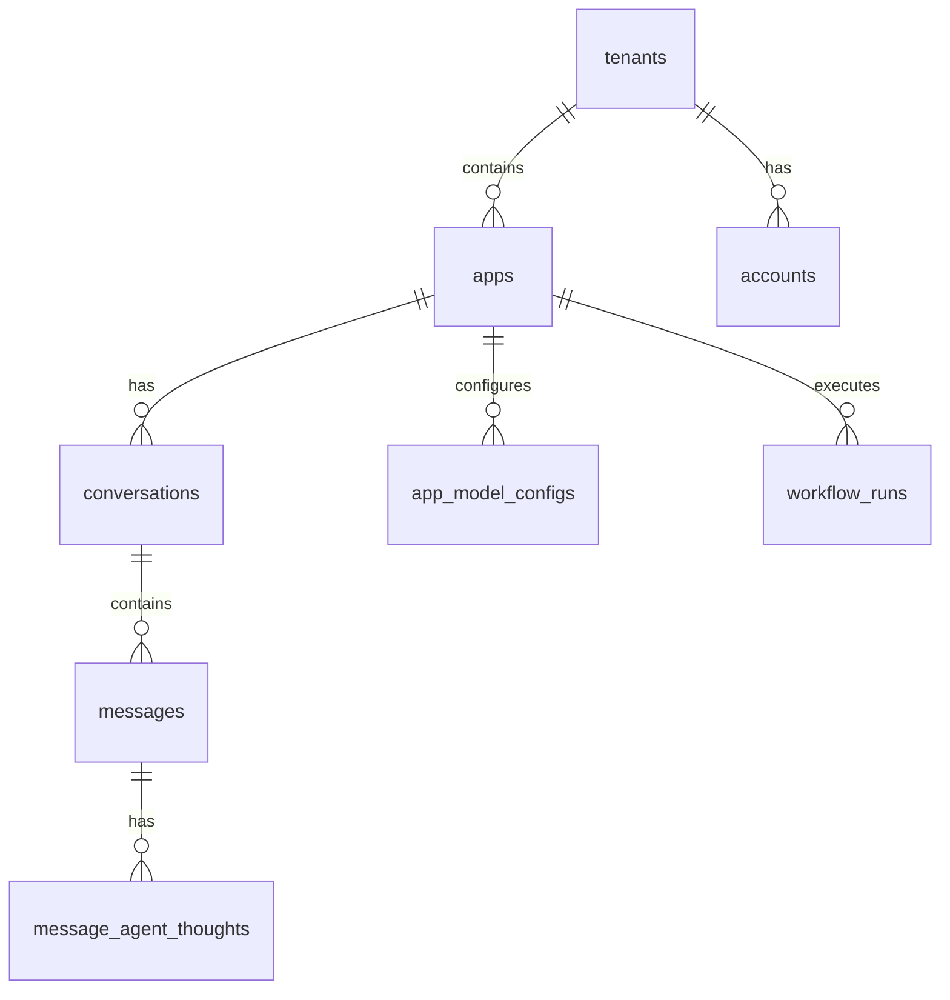

# Dify 源码学习指南

## 项目概述

Dify 是一个开源的大语言模型（LLM）应用开发平台，提供直观的界面来构建和部署AI工作流、RAG管道、智能体（Agent）等功能。本指南将帮助您深入理解Dify的源码架构和实现细节。

### 核心特性
- **工作流引擎**: 可视化AI工作流构建
- **RAG管道**: 检索增强生成系统
- **智能体系统**: 支持函数调用和ReAct模式的AI代理
- **模型管理**: 支持100+种大语言模型
- **多租户架构**: 企业级的用户和权限管理
- **插件系统**: 可扩展的工具和集成

## 项目技术栈

### 后端 (API)
- **框架**: Python + Flask 3.1
- **ORM**: SQLAlchemy 2.0
- **任务队列**: Celery + Redis
- **数据库**: PostgreSQL (主数据库)
- **向量数据库**: Weaviate/Qdrant/Milvus等
- **AI/ML库**: Transformers, OpenAI, TikToken
- **存储**: 支持多种云存储（AWS S3, Azure Blob, 阿里云OSS等）

### 前端 (Web)
- **框架**: Next.js 15.3.5 + React 19.1
- **类型系统**: TypeScript
- **样式**: Tailwind CSS
- **状态管理**: Zustand
- **UI组件**: Headless UI, Heroicons
- **图表**: ECharts, ReactFlow
- **文本编辑**: Lexical

### 基础设施
- **容器化**: Docker + Docker Compose
- **反向代理**: Nginx
- **监控**: OpenTelemetry, Sentry
- **开发工具**: ESLint, Prettier, MyPy

## 项目目录结构详解

```
dify-study/
├── api/                      # 后端API服务
│   ├── app.py               # 应用入口文件
│   ├── app_factory.py       # Flask应用工厂
│   ├── configs/             # 配置管理
│   ├── controllers/         # 控制器层
│   ├── core/               # 核心业务逻辑
│   ├── extensions/         # Flask扩展
│   ├── models/             # 数据模型
│   ├── services/           # 业务服务层
│   └── tasks/              # Celery异步任务
├── web/                     # 前端Web应用
│   ├── app/                # Next.js应用目录
│   ├── components/         # React组件
│   ├── context/            # React上下文
│   ├── hooks/              # 自定义Hooks
│   ├── i18n/               # 国际化
│   └── service/            # API服务调用
├── docker/                  # Docker配置
├── sdks/                    # 多语言SDK
└── docs/                    # 文档
```

## 核心文件功能详解

### 后端核心文件

#### 1. `/api/app.py` - 应用入口
**功能**: 应用启动的主入口文件
**关键特性**:
- 远程调试配置支持
- Gevent异步处理
- 数据库迁移命令支持

```python
# 核心启动逻辑
def setup_remote_debug():
    """设置远程调试支持开发环境"""
    
def is_db_command():
    """检测是否为数据库命令"""
    
# 应用创建分支：迁移 vs 常规运行
if is_db_command():
    app = create_migrations_app()
else:
    app = create_app()
```

#### 2. `/api/app_factory.py` - 应用工厂
**功能**: Flask应用的创建和配置管理
**关键方法**:

```python
def create_app() -> DifyApp:
    """创建完整的Flask应用实例"""
    
def create_flask_app_with_configs() -> DifyApp:
    """创建基础Flask应用并加载配置"""
    
def initialize_extensions(app: DifyApp):
    """初始化所有Flask扩展组件"""
```

**扩展初始化顺序**:
1. `ext_timezone` - 时区设置
2. `ext_logging` - 日志系统  
3. `ext_database` - 数据库连接
4. `ext_redis` - Redis缓存
5. `ext_celery` - 异步任务队列
6. `ext_blueprints` - 路由蓝图注册

#### 3. `/api/dify_app.py` - 应用基类
**功能**: Dify自定义Flask应用类
```python
class DifyApp(Flask):
    """继承Flask，为Dify定制的应用类"""
    pass
```

#### 4. `/api/core/model_manager.py` - 模型管理器
**功能**: 统一管理各种AI模型的调用和负载均衡
**关键组件**:

```python
class ModelInstance:
    """模型实例，封装模型调用逻辑"""
    
    def invoke_llm(self, prompt_messages, **kwargs):
        """调用大语言模型"""
        return self._round_robin_invoke(...)
    
    def invoke_text_embedding(self, texts, **kwargs):
        """调用文本嵌入模型"""
        
    def invoke_rerank(self, query, docs, **kwargs):
        """调用重排序模型"""

class ModelManager:
    """模型管理器主类"""
    
    def get_model_instance(self, tenant_id, provider, model_type, model):
        """获取模型实例"""
        
    def get_default_model_instance(self, tenant_id, model_type):
        """获取默认模型实例"""

class LBModelManager:
    """负载均衡模型管理器"""
    
    def fetch_next(self):
        """轮询获取下一个可用的模型配置"""
        
    def cooldown(self, config, expire=60):
        """将失败的配置冷却一段时间"""
```

#### 5. `/api/core/tools/tool_manager.py` - 工具管理器
**功能**: 管理所有类型的工具（内置、API、插件、工作流、MCP）
**关键方法**:

```python
class ToolManager:
    """工具管理器"""
    
    @classmethod
    def get_tool_runtime(cls, provider_type, provider_id, tool_name, ...):
        """获取工具运行时实例"""
        
    @classmethod
    def get_agent_tool_runtime(cls, tenant_id, app_id, agent_tool, ...):
        """获取智能体工具运行时"""
        
    @classmethod
    def get_workflow_tool_runtime(cls, tenant_id, app_id, node_id, ...):
        """获取工作流工具运行时"""
        
    @classmethod
    def list_builtin_providers(cls, tenant_id):
        """列出所有内置工具提供商"""
```

#### 6. `/api/services/app_service.py` - 应用服务
**功能**: 应用的业务逻辑处理
**主要方法**:

```python
class AppService:
    """应用服务类"""
    
    def get_paginate_apps(self, user_id, tenant_id, args):
        """分页获取应用列表"""
        
    def create_app(self, tenant_id, args, account):
        """创建新应用"""
        # 获取默认模型配置
        # 创建应用实例
        # 初始化模型配置
        # 触发应用创建事件
        
    def get_app(self, app):
        """获取应用详情（含工具参数解密）"""
        
    def update_app(self, app, args):
        """更新应用信息"""
        
    def delete_app(self, app):
        """删除应用（异步清理相关数据）"""
```

#### 7. `/api/core/agent/base_agent_runner.py` - 智能体运行器
**功能**: 智能体系统的核心运行逻辑
**关键组件**:

```python
class BaseAgentRunner(AppRunner):
    """智能体运行器基类"""
    
    def __init__(self, **kwargs):
        """初始化智能体运行环境"""
        # 工具初始化
        self.dataset_tools = DatasetRetrieverTool.get_dataset_tools()
        # 回调处理器
        self.agent_callback = DifyAgentCallbackHandler()
    
    def _convert_tool_to_prompt_message_tool(self, tool):
        """工具转换为提示消息工具"""
        
    def create_agent_thought(self, **params):
        """创建智能体思考记录"""
        
    def organize_agent_history(self, prompt_messages):
        """组织智能体对话历史"""
```

### 前端核心文件

#### 1. `/web/app/layout.tsx` - 根布局组件
**功能**: Next.js应用的根布局配置
**关键特性**:

```tsx
const LocaleLayout = async ({ children }) => {
  // 国际化配置
  const locale = await getLocaleOnServer()
  
  // 环境变量映射
  const datasetMap: Record<DatasetAttr, string> = {
    // API端点配置
    // 功能开关配置
    // 限制参数配置
  }
  
  return (
    <html lang={locale} className="h-full">
      <body {...datasetMap}>
        {/* 多层Provider嵌套 */}
        <ThemeProvider>
          <BrowserInitializer>
            <SentryInitializer>
              <TanstackQueryInitializer>
                <I18nServer>
                  <GlobalPublicStoreProvider>
                    {children}
                  </GlobalPublicStoreProvider>
                </I18nServer>
              </TanstackQueryInitializer>
            </SentryInitializer>
          </BrowserInitializer>
        </ThemeProvider>
      </body>
    </html>
  )
}
```

## 核心业务逻辑分析

### 1. 智能体系统 (Agent System)

#### 智能体运行流程
1. **初始化阶段**:
   - 加载工具集合 (`_init_prompt_tools`)
   - 初始化数据集检索工具
   - 设置回调处理器

2. **对话处理阶段**:
   - 组织历史对话 (`organize_agent_history`)
   - 转换用户输入 (`organize_agent_user_prompt`)
   - 执行工具调用

3. **思考记录阶段**:
   - 创建思考记录 (`create_agent_thought`)
   - 保存执行结果 (`save_agent_thought`)

#### 工具管理机制
```python
# 工具转换流程
def _convert_tool_to_prompt_message_tool(self, tool: AgentToolEntity):
    """将业务工具转换为LLM可理解的工具描述"""
    tool_entity = ToolManager.get_agent_tool_runtime(...)
    message_tool = PromptMessageTool(
        name=tool.tool_name,
        description=tool_entity.entity.description.llm,
        parameters=self._build_tool_parameters(tool_entity)
    )
    return message_tool, tool_entity
```

### 2. 工作流系统 (Workflow System)

#### 工作流执行架构
- **节点类型**: 条件节点、工具节点、LLM节点、代码节点等
- **执行策略**: 串行、并行、条件分支
- **状态管理**: 节点状态跟踪、执行结果缓存
- **错误处理**: 重试机制、错误传播、回滚策略

### 3. RAG系统 (检索增强生成)

#### 文档处理流程
1. **文档摄入**: 
   - 支持多种格式 (PDF, DOCX, TXT, MD等)
   - 文档解析和预处理
   - 内容清洗和标准化

2. **向量化存储**:
   - 文本分块处理
   - 向量嵌入生成
   - 向量数据库存储

3. **检索匹配**:
   - 语义相似度搜索
   - 混合检索策略
   - 结果排序和过滤

## 关键类和方法详解

### 1. ModelInstance类
**位置**: `/api/core/model_manager.py:30`
**作用**: 模型实例的核心封装类，提供统一的模型调用接口

**重要方法**:

```python
def __init__(self, provider_model_bundle, model):
    """
    初始化模型实例
    - 提取模型凭证信息
    - 设置负载均衡管理器
    - 检查流式工具调用支持
    """

def invoke_llm(self, prompt_messages, model_parameters=None, tools=None, stream=True, **kwargs):
    """
    调用大语言模型核心方法
    - 支持流式和非流式输出
    - 支持工具调用
    - 自动负载均衡和错误重试
    """

def _round_robin_invoke(self, function, *args, **kwargs):
    """
    轮询调用方法 - 负载均衡的核心实现
    - 轮询选择可用的模型配置
    - 处理速率限制和认证错误
    - 自动冷却失败的配置
    """
```

**负载均衡机制**:
- 使用Redis存储轮询索引
- 支持配置冷却机制（失败后临时禁用）
- 区分不同错误类型的冷却时间

### 2. ToolManager类
**位置**: `/api/core/tools/tool_manager.py:68`
**作用**: 工具系统的统一管理器

**核心设计模式**:
```python
# 工具类型枚举
class ToolProviderType(Enum):
    BUILT_IN = "builtin"      # 内置工具
    API = "api"               # API工具
    WORKFLOW = "workflow"     # 工作流工具
    PLUGIN = "plugin"         # 插件工具
    MCP = "mcp"              # MCP工具

# 统一工具获取接口
@classmethod
def get_tool_runtime(cls, provider_type, provider_id, tool_name, tenant_id, ...):
    """
    根据提供商类型分发到不同的工具处理逻辑
    - 内置工具: 从硬编码提供商加载
    - API工具: 从数据库加载配置和凭证
    - 工作流工具: 转换工作流为工具
    - 插件工具: 从插件系统加载
    - MCP工具: 从MCP服务器加载
    """
```

**工具参数加密机制**:
```python
# 加密管理器
encryption_manager = ToolParameterConfigurationManager(
    tenant_id=tenant_id,
    tool_runtime=tool_entity,
    provider_name=provider_id,
    provider_type=provider_type,
    identity_id=f"AGENT.{app_id}",  # 按应用隔离
)

# 参数解密
runtime_parameters = encryption_manager.decrypt_tool_parameters(parameters)
```

### 3. BaseAgentRunner类
**位置**: `/api/core/agent/base_agent_runner.py:49`
**作用**: 智能体运行的核心基类

**重要方法**:

```python
def __init__(self, **kwargs):
    """
    初始化智能体运行器
    - 设置基础配置（租户ID、应用配置等）
    - 初始化工具集合
    - 设置回调处理器
    - 检查模型能力支持
    """

def _convert_tool_to_prompt_message_tool(self, tool):
    """
    工具转换核心方法
    - 将业务工具转换为LLM可理解的格式
    - 处理工具参数和描述
    - 返回提示工具和工具实体
    """

def create_agent_thought(self, message_id, message, tool_name, tool_input, messages_ids):
    """
    创建智能体思考记录
    - 生成唯一的思考ID
    - 记录工具调用信息
    - 保存到数据库
    """

def organize_agent_history(self, prompt_messages):
    """
    组织对话历史
    - 提取历史消息
    - 构建完整对话上下文
    - 处理工具调用记录
    """
```

**智能体思考链**:
```python
# 思考记录结构
MessageAgentThought:
    - thought: 智能体的思考过程
    - tool: 使用的工具名称
    - tool_input: 工具输入参数
    - observation: 工具执行结果
    - answer: 最终回答
    - message_token: 消息令牌数
    - answer_token: 回答令牌数
    - total_price: 总费用
```

### 4. AppService类
**位置**: `/api/services/app_service.py:29`
**作用**: 应用管理的业务逻辑服务

**核心业务流程**:

```python
def create_app(self, tenant_id, args, account):
    """
    应用创建流程
    1. 根据应用模式选择模板
    2. 获取默认模型配置
    3. 创建应用实例
    4. 初始化模型配置
    5. 触发应用创建事件
    """
    app_mode = AppMode.value_of(args["mode"])
    app_template = default_app_templates[app_mode]
    
    # 模型配置初始化
    model_manager = ModelManager()
    model_instance = model_manager.get_default_model_instance(
        tenant_id=account.current_tenant_id,
        model_type=ModelType.LLM
    )
    
    # 应用实例创建
    app = App(**app_template["app"])
    # ... 设置应用属性
    
    # 模型配置关联
    app_model_config = AppModelConfig(**default_model_config)
    app_model_config.app_id = app.id
    
    # 触发事件
    app_was_created.send(app, account=account)
```

### 5. 前端工作流组件
**位置**: `/web/app/components/workflow-app/components/workflow-main.tsx:21`
**作用**: 工作流主组件，管理工作流的状态和操作

**核心Hooks**:
```typescript
// 节点同步
const { doSyncWorkflowDraft, syncWorkflowDraftWhenPageClose } = useNodesSyncDraft()

// 工作流运行
const { handleRun, handleStopRun, handleBackupDraft } = useWorkflowRun()

// 工作流启动
const { handleStartWorkflowRun } = useWorkflowStartRun()

// 变量检查
const { fetchInspectVars, editInspectVarValue } = useInspectVarsCrud()
```

**状态管理架构**:
```typescript
// Zustand状态存储
const workflowStore = useWorkflowStore()
const featuresStore = useFeaturesStore()

// 状态更新处理
const handleWorkflowDataUpdate = useCallback((payload) => {
    const { features, conversation_variables, environment_variables } = payload
    
    if (features) {
        setFeatures(features)
    }
    if (conversation_variables) {
        setConversationVariables(conversation_variables)
    }
    if (environment_variables) {
        setEnvironmentVariables(environment_variables)
    }
}, [featuresStore, workflowStore])
```

## 核心业务逻辑分析

### 1. 智能体系统 (Agent System)

#### 智能体运行流程
1. **初始化阶段**:
   - 加载工具集合 (`_init_prompt_tools`)
   - 初始化数据集检索工具
   - 设置回调处理器

2. **对话处理阶段**:
   - 组织历史对话 (`organize_agent_history`)
   - 转换用户输入 (`organize_agent_user_prompt`)
   - 执行工具调用

3. **思考记录阶段**:
   - 创建思考记录 (`create_agent_thought`)
   - 保存执行结果 (`save_agent_thought`)

#### 工具管理机制
```python
# 工具转换流程
def _convert_tool_to_prompt_message_tool(self, tool: AgentToolEntity):
    """将业务工具转换为LLM可理解的工具描述"""
    tool_entity = ToolManager.get_agent_tool_runtime(...)
    message_tool = PromptMessageTool(
        name=tool.tool_name,
        description=tool_entity.entity.description.llm,
        parameters=self._build_tool_parameters(tool_entity)
    )
    return message_tool, tool_entity
```

#### 智能体思考链机制
```python
# ReAct模式实现
1. Thought: 智能体分析问题并规划行动
2. Action: 选择并调用合适的工具
3. Observation: 观察工具执行结果
4. Reflection: 基于结果调整策略
5. Final Answer: 生成最终回答
```

### 2. 模型管理系统

#### 多模型支持架构
```python
# 模型类型枚举
class ModelType(Enum):
    LLM = "llm"                    # 大语言模型
    TEXT_EMBEDDING = "text-embedding"  # 文本嵌入
    RERANK = "rerank"              # 重排序
    SPEECH2TEXT = "speech2text"    # 语音转文本
    TTS = "tts"                    # 文本转语音
    MODERATION = "moderation"      # 内容审核
```

#### 负载均衡策略
```python
# 轮询算法实现
def fetch_next(self) -> ModelLoadBalancingConfiguration:
    """
    获取下一个可用配置
    1. Redis递增计数器
    2. 模运算选择配置
    3. 检查冷却状态
    4. 返回可用配置
    """
    current_index = redis_client.incr(cache_key)
    real_index = (current_index - 1) % max_index
    config = self._load_balancing_configs[real_index]
    
    if self.in_cooldown(config):
        continue  # 跳过冷却中的配置
    
    return config
```

#### 错误处理机制
```python
# 分级错误处理
try:
    return function(*args, **kwargs, credentials=config.credentials)
except InvokeRateLimitError as e:
    # 速率限制：冷却60秒
    self.cooldown(config, expire=60)
except (InvokeAuthorizationError, InvokeConnectionError) as e:
    # 认证/连接错误：冷却10秒
    self.cooldown(config, expire=10)
except Exception as e:
    # 其他错误：直接抛出
    raise e
```

### 3. 工具系统架构

#### 工具类型体系
```python
# 工具提供商层次结构
ToolProviderController (基类)
├── BuiltinToolProviderController  # 内置工具
├── ApiToolProviderController      # API工具
├── PluginToolProviderController   # 插件工具
├── WorkflowToolProviderController # 工作流工具
└── MCPToolProviderController     # MCP工具
```

#### 工具运行时机制
```python
# 工具运行时创建
def fork_tool_runtime(self, runtime: ToolRuntime):
    """
    创建工具运行时副本
    - 设置租户隔离
    - 配置凭证信息
    - 注入运行参数
    """
    cloned_tool = copy.deepcopy(self)
    cloned_tool.runtime = runtime
    return cloned_tool
```

#### 参数加密体系
```python
# 分层加密策略
class ToolParameterConfigurationManager:
    """
    工具参数配置管理器
    - 租户级别隔离
    - 应用级别隔离
    - 节点级别隔离
    """
    
    def encrypt_tool_parameters(self, parameters: dict) -> dict:
        """加密敏感参数"""
        
    def decrypt_tool_parameters(self, parameters: dict) -> dict:
        """解密参数用于运行"""
        
    def mask_tool_parameters(self, parameters: dict) -> dict:
        """掩码参数用于显示"""
```

### 4. 应用生命周期管理

#### 应用创建流程
```python
def create_app(self, tenant_id: str, args: dict, account: Account) -> App:
    """
    完整的应用创建流程
    1. 解析应用模式和模板
    2. 获取默认模型配置
    3. 创建应用数据库记录
    4. 初始化模型配置
    5. 触发应用创建事件
    6. 设置企业级安全策略
    """
```

#### 应用配置管理
```python
# 应用模式枚举
class AppMode(Enum):
    COMPLETION = "completion"      # 文本补全
    CHAT = "chat"                 # 简单聊天
    ADVANCED_CHAT = "advanced-chat"  # 高级聊天
    AGENT_CHAT = "agent-chat"     # 智能体聊天
    WORKFLOW = "workflow"         # 工作流
```

#### 事件驱动架构
```python
# 应用事件系统
from events.app_event import app_was_created

# 事件触发
app_was_created.send(app, account=account)

# 事件处理器（异步）
@app_was_created.connect
def handle_app_creation(sender, **extra):
    """处理应用创建后的初始化任务"""
```

### 5. 前端状态管理

#### React状态管理策略
```typescript
// 全局状态管理
const useWorkflowStore = create<WorkflowState>((set, get) => ({
  // 工作流基础状态
  nodes: [],
  edges: [],
  viewport: { x: 0, y: 0, zoom: 1 },
  
  // 状态更新方法
  setNodes: (nodes) => set({ nodes }),
  setEdges: (edges) => set({ edges }),
  updateViewport: (viewport) => set({ viewport }),
}))
```

#### Hook组合模式
```typescript
// 复合Hook设计
const useWorkflowOperations = () => {
  const store = useWorkflowStore()
  const { doSyncWorkflowDraft } = useNodesSyncDraft()
  const { handleRun } = useWorkflowRun()
  
  return {
    ...store.getState(),
    doSyncWorkflowDraft,
    handleRun,
  }
}
```

## 数据库模型设计

### 核心表结构

#### 1. 应用相关表
- `apps`: 应用基础信息
- `app_model_configs`: 应用模型配置
- `conversations`: 对话会话
- `messages`: 消息记录
- `message_agent_thoughts`: 智能体思考记录

#### 2. 用户和租户表
- `tenants`: 租户信息
- `accounts`: 用户账户
- `tenant_account_joins`: 租户用户关联

#### 3. 数据集相关表
- `datasets`: 数据集基础信息
- `documents`: 文档记录
- `document_segments`: 文档片段
- `dataset_queries`: 查询记录

#### 4. 工作流相关表
- `workflows`: 工作流定义
- `workflow_runs`: 工作流执行记录
- `workflow_node_executions`: 节点执行记录

## API路由设计

### 控制器层级结构
```
/api/controllers/
├── console/          # 控制台管理API
│   ├── admin.py     # 管理员功能
│   ├── apikey.py    # API密钥管理
│   └── setup.py     # 系统设置
├── web/             # Web端API
│   ├── app.py       # 应用相关
│   ├── conversation.py  # 对话管理
│   └── message.py   # 消息处理
└── service_api/     # 服务API
    └── index.py     # 服务接口
```

### 典型API端点
- `POST /v1/chat-messages` - 发送聊天消息
- `GET /v1/conversations` - 获取对话列表
- `POST /v1/workflows/run` - 执行工作流
- `GET /v1/datasets` - 获取数据集列表

## 前端架构分析

### React组件层级
```
/web/app/
├── (commonLayout)/   # 通用布局
├── (shareLayout)/    # 共享布局
├── account/          # 账户管理
├── components/       # 通用组件
└── signin/          # 登录相关
```

### 状态管理策略
- **全局状态**: Zustand store
- **服务端状态**: TanStack Query
- **表单状态**: React Hook Form
- **本地状态**: useState, useContext

### 国际化实现
- 使用 `react-i18next`
- 支持多语言切换
- 服务端渲染国际化

### 架构设计模式

#### 1. 多租户架构
```python
# 租户隔离设计
class TenantIsolation:
    """
    所有数据访问都基于tenant_id进行隔离
    - 数据库级别：每个查询都包含tenant_id过滤
    - 应用级别：中间件自动注入租户上下文
    - 缓存级别：Redis键包含租户前缀
    """
    
# 示例：应用查询
apps = db.session.query(App).where(
    App.tenant_id == current_user.current_tenant_id,
    App.is_universal == False
).all()
```

#### 2. 插件化架构
```python
# 插件系统设计
class PluginSystem:
    """
    支持多种插件类型
    - 工具插件：扩展智能体能力
    - 模型插件：集成新的AI模型
    - 数据源插件：连接外部数据源
    """
    
# 插件生命周期管理
def load_plugin(plugin_id: str):
    """加载插件"""
    
def unload_plugin(plugin_id: str):
    """卸载插件"""
    
def reload_plugin(plugin_id: str):
    """重新加载插件"""
```

#### 3. 事件驱动架构
```python
# 事件系统
from blinker import Namespace

# 定义事件命名空间
app_events = Namespace()

# 应用创建事件
app_was_created = app_events.signal('app-was-created')
app_was_deleted = app_events.signal('app-was-deleted')

# 事件监听器
@app_was_created.connect
def init_app_settings(sender, **extra):
    """应用创建后初始化设置"""
    
@app_was_deleted.connect  
def cleanup_app_data(sender, **extra):
    """应用删除后清理数据"""
```

#### 4. 微服务架构准备
```python
# 服务边界划分
class ServiceBoundaries:
    """
    当前单体架构，但设计时考虑了微服务拆分
    - UserService: 用户管理
    - AppService: 应用管理  
    - ModelService: 模型管理
    - ToolService: 工具管理
    - WorkflowService: 工作流引擎
    """
```

## 性能优化策略

### 1. 数据库优化
```sql
-- 关键索引设计
CREATE INDEX idx_apps_tenant_created ON apps(tenant_id, created_at DESC);
CREATE INDEX idx_messages_conversation ON messages(conversation_id, created_at);
CREATE INDEX idx_agent_thoughts_message ON message_agent_thoughts(message_id, position);

-- 分区表策略（大数据量时）
CREATE TABLE messages_partitioned (
    ...
) PARTITION BY RANGE (created_at);
```

### 2. 缓存策略
```python
# 多层缓存设计
class CacheStrategy:
    """
    L1: 应用内存缓存 (工具定义、模型配置)
    L2: Redis缓存 (对话历史、模型响应)
    L3: 分布式缓存 (向量嵌入、文档片段)
    """

# Redis缓存键命名规范
CACHE_KEYS = {
    'tool_provider': 'tool:provider:{tenant_id}:{provider_id}',
    'model_config': 'model:config:{tenant_id}:{model_id}', 
    'conversation': 'conv:{conversation_id}',
    'agent_thought': 'thought:{message_id}:{position}',
}
```

### 3. 异步处理
```python
# Celery任务队列
@celery.task(bind=True, max_retries=3)
def process_document_embedding(self, document_id: str):
    """异步处理文档向量化"""
    
@celery.task(bind=True)
def cleanup_expired_conversations(self):
    """定期清理过期对话"""

@celery.task(bind=True) 
def send_notification_email(self, user_id: str, event_type: str):
    """异步发送通知邮件"""
```

### 4. 流式处理
```python
# SSE流式响应
def stream_chat_response(message_id: str):
    """流式返回聊天响应"""
    def generate():
        for chunk in llm_response_stream:
            yield f"data: {json.dumps(chunk)}\n\n"
        yield "data: [DONE]\n\n"
    
    return Response(
        generate(),
        mimetype='text/event-stream',
        headers={
            'Cache-Control': 'no-cache',
            'Connection': 'keep-alive',
        }
    )
```

## 安全机制

### 1. 认证授权
```python
# JWT Token认证
class AuthenticationManager:
    def generate_access_token(self, user_id: str) -> str:
        """生成访问令牌"""
        
    def verify_token(self, token: str) -> dict:
        """验证令牌有效性"""

# RBAC权限控制  
class PermissionManager:
    def check_permission(self, user_id: str, resource: str, action: str) -> bool:
        """检查用户权限"""
```

### 2. 数据加密
```python
# 敏感数据加密
class EncryptionManager:
    def encrypt_sensitive_data(self, data: dict) -> str:
        """加密敏感数据"""
        
    def decrypt_sensitive_data(self, encrypted_data: str) -> dict:
        """解密敏感数据"""

# 工具参数加密示例
encrypted_params = encryption_manager.encrypt_tool_parameters({
    'api_key': 'sk-xxx',
    'secret': 'very-secret-value'
})
```

### 3. 输入验证
```python
# 请求参数验证
from marshmallow import Schema, fields, validate

class CreateAppSchema(Schema):
    name = fields.Str(required=True, validate=validate.Length(min=1, max=100))
    mode = fields.Str(required=True, validate=validate.OneOf(['chat', 'completion', 'workflow']))
    description = fields.Str(validate=validate.Length(max=500))

# XSS防护
def sanitize_input(text: str) -> str:
    """清理用户输入，防止XSS攻击"""
    return bleach.clean(text, tags=[], strip=True)
```

### 4. 速率限制
```python
# API限流
from flask_limiter import Limiter

limiter = Limiter(
    app,
    key_func=lambda: current_user.id,
    default_limits=["1000 per hour"]
)

@app.route('/api/chat/messages', methods=['POST'])
@limiter.limit("60 per minute")
def create_chat_message():
    """创建聊天消息 - 限制每分钟60次"""
```

## 监控和运维

### 1. 日志系统
```python
# 结构化日志
import structlog

logger = structlog.get_logger(__name__)

# 业务日志记录
logger.info(
    "agent_tool_invoked",
    user_id=user_id,
    app_id=app_id,
    tool_name=tool_name,
    execution_time=execution_time,
    success=True
)
```

### 2. 指标监控
```python
# Prometheus指标
from prometheus_client import Counter, Histogram, Gauge

# 业务指标
chat_messages_total = Counter('chat_messages_total', 'Total chat messages', ['app_mode'])
tool_execution_duration = Histogram('tool_execution_duration_seconds', 'Tool execution time')
active_conversations = Gauge('active_conversations', 'Number of active conversations')
```

### 3. 健康检查
```python
@app.route('/health')
def health_check():
    """系统健康检查"""
    checks = {
        'database': check_database_connection(),
        'redis': check_redis_connection(),
        'vector_db': check_vector_database(),
        'model_providers': check_model_providers(),
    }
    
    all_healthy = all(checks.values())
    status_code = 200 if all_healthy else 503
    
    return jsonify({
        'status': 'healthy' if all_healthy else 'unhealthy',
        'checks': checks,
        'timestamp': datetime.utcnow().isoformat()
    }), status_code
```

## 测试策略

### 1. 单元测试
```python
# 模型管理器测试
class TestModelManager:
    def test_get_model_instance(self):
        """测试获取模型实例"""
        model_manager = ModelManager()
        instance = model_manager.get_model_instance(
            tenant_id="test",
            provider="openai", 
            model_type=ModelType.LLM,
            model="gpt-3.5-turbo"
        )
        assert instance is not None
        assert instance.provider == "openai"
```

### 2. 集成测试  
```python
# 智能体端到端测试
class TestAgentWorkflow:
    def test_agent_tool_execution(self):
        """测试智能体工具执行流程"""
        # 创建测试应用
        app = create_test_app()
        
        # 配置工具
        tool_config = create_test_tool_config()
        
        # 执行对话
        response = send_chat_message(app.id, "帮我查询天气")
        
        # 验证结果
        assert response['answer'] is not None
        assert len(response['agent_thoughts']) > 0
```

### 3. 性能测试
```python
# 负载测试
import asyncio
import aiohttp

async def stress_test_chat_api():
    """聊天API压力测试"""
    async with aiohttp.ClientSession() as session:
        tasks = []
        for i in range(100):  # 100并发请求
            task = send_chat_request(session, f"测试消息 {i}")
            tasks.append(task)
        
        results = await asyncio.gather(*tasks)
        
        # 分析结果
        success_count = sum(1 for r in results if r.status == 200)
        avg_response_time = sum(r.response_time for r in results) / len(results)
        
        print(f"成功率: {success_count/len(results)*100}%")
        print(f"平均响应时间: {avg_response_time}ms")
```

## 部署和配置

### Docker容器服务
```yaml
services:
  api:           # API服务
  worker:        # Celery工作进程
  worker_beat:   # 定时任务调度
  web:           # 前端服务
  db:            # PostgreSQL数据库
  redis:         # Redis缓存
  nginx:         # 反向代理
  sandbox:       # 代码执行沙箱
```

### 环境变量配置
- 数据库连接配置
- Redis连接配置  
- 模型API配置
- 存储配置
- 安全密钥配置

## 开发调试指南

### 后端调试
1. **远程调试**: 支持debugpy远程调试
2. **日志记录**: 结构化日志输出
3. **错误监控**: Sentry集成
4. **性能监控**: OpenTelemetry追踪

### 前端调试
1. **开发服务器**: Next.js开发模式
2. **类型检查**: TypeScript严格模式
3. **代码质量**: ESLint + Prettier
4. **组件测试**: Jest + Testing Library

## 扩展开发

### 插件系统
- **插件接口**: 标准化插件API
- **生命周期**: 插件加载、执行、卸载
- **沙箱环境**: 安全的插件执行环境
- **权限控制**: 插件权限管理

### 自定义工具开发
```python
# 工具开发示例
class CustomTool(Tool):
    def get_runtime_parameters(self):
        """定义工具参数"""
        
    def invoke(self, user_id, tool_parameters):
        """工具执行逻辑"""
```

### 模型提供商集成
- 实现标准化模型接口
- 支持流式输出
- 错误处理和重试
- 费用统计和限制

## 最佳实践

### 代码规范
1. **Python**: 遵循PEP 8规范
2. **TypeScript**: 使用严格类型检查
3. **API设计**: RESTful风格
4. **错误处理**: 统一错误码体系

### 性能优化
1. **数据库优化**: 索引设计、查询优化
2. **缓存策略**: Redis缓存、应用缓存
3. **异步处理**: Celery任务队列
4. **前端优化**: 代码分割、懒加载

### 安全考虑
1. **输入验证**: 严格的参数校验
2. **权限控制**: RBAC权限模型
3. **数据隔离**: 多租户数据隔离
4. **API安全**: 身份认证、频率限制

## 学习路径建议

### 新手入门路径 (1-2周)
1. **环境搭建和基础运行**
   - 克隆项目并使用Docker快速启动
   - 创建第一个聊天应用，体验基本功能
   - 阅读项目README和官方文档

2. **理解项目结构**
   - 熟悉`/api`和`/web`目录结构
   - 理解Flask应用启动流程 (`app.py` → `app_factory.py`)
   - 了解Next.js前端架构和路由设计

3. **核心概念学习**
   - 应用模式：Chat、Completion、Agent、Workflow
   - 多租户架构：理解tenant_id的作用
   - 模型管理：支持的模型类型和配置方式

### 进阶开发路径 (2-4周)
1. **深入后端架构**
   - 分析`ModelManager`和`ToolManager`的设计模式
   - 理解智能体系统的工作流程
   - 学习数据库模型设计和ORM使用

2. **前端状态管理**
   - 掌握Zustand状态管理库的使用
   - 理解React Hook组合模式
   - 学习工作流编辑器的实现原理

3. **业务逻辑分析**
   - 研究应用创建和配置流程
   - 理解对话管理和消息处理
   - 分析工具调用和参数加密机制

### 高级专家路径 (4-8周)
1. **架构深度分析**
   - 研究负载均衡和容错机制
   - 理解插件系统和扩展机制
   - 分析性能优化策略

2. **二次开发实践**
   - 开发自定义工具插件
   - 集成新的模型提供商
   - 实现自定义工作流节点

3. **贡献开源社区**
   - 修复bug和提交PR
   - 完善文档和测试用例
   - 参与架构讨论和设计

### 实践项目建议
1. **基础练习**
   - 创建自定义API工具
   - 配置本地模型服务
   - 开发简单的聊天机器人

2. **中级项目**
   - 实现知识库问答系统
   - 开发多模态智能体
   - 构建工作流自动化应用

3. **高级挑战**
   - 优化大规模部署性能
   - 实现企业级安全增强
   - 开发分布式向量数据库支持

## 常见问题和解决方案

### 1. 开发环境问题
**Q: Docker启动失败，提示端口冲突**
```bash
# 解决方案：修改docker-compose.yaml中的端口映射
services:
  web:
    ports:
      - "3001:3000"  # 改为3001端口
  api:
    ports:
      - "5001:5001"  # API端口
```

**Q: 数据库连接失败**
```bash
# 检查环境变量配置
export DB_USERNAME=postgres
export DB_PASSWORD=difyai123456
export DB_HOST=localhost
export DB_PORT=5432
export DB_DATABASE=dify

# 或修改.env文件
```

### 2. 模型配置问题
**Q: 如何添加本地模型服务**
```python
# 在configs/model_providers.yaml中添加配置
my_local_llm:
  provider_type: custom
  base_url: "http://localhost:8000/v1"
  api_key: "your-api-key"
  models:
    - model_name: "local-llm-7b"
      model_type: "llm"
```

**Q: 模型调用超时**
```python
# 修改模型配置中的超时设置
model_config = {
    "timeout": 120,  # 增加到120秒
    "max_retries": 3,
    "retry_delay": 1
}
```

### 3. 工具开发问题
**Q: 自定义工具参数加密**
```python
# 在工具定义中标记需要加密的参数
class MyTool(Tool):
    def get_runtime_parameters(self):
        return [
            ToolParameter(
                name="api_key",
                type=ToolParameter.ToolParameterType.SECRET_INPUT,
                required=True
            )
        ]
```

**Q: 工具调用权限控制**
```python
# 实现工具权限检查
def check_tool_permission(user_id: str, tool_name: str) -> bool:
    user_permissions = get_user_permissions(user_id)
    return f"tool:{tool_name}" in user_permissions
```

### 4. 性能优化问题
**Q: 大量对话历史导致响应慢**
```python
# 实现对话历史分页加载
def get_conversation_messages(conversation_id: str, limit: int = 50):
    return db.session.query(Message)\
        .filter(Message.conversation_id == conversation_id)\
        .order_by(Message.created_at.desc())\
        .limit(limit).all()
```

**Q: 向量检索性能优化**
```python
# 使用异步批量处理
async def batch_vector_search(queries: List[str], top_k: int = 5):
    tasks = [vector_search(query, top_k) for query in queries]
    results = await asyncio.gather(*tasks)
    return results
```

## 社区资源

### 官方资源
- **GitHub**: https://github.com/langgenius/dify
- **官方文档**: https://docs.dify.ai/
- **官方网站**: https://dify.ai/
- **Discord社区**: https://discord.gg/dify

### 学习资源
- **技术博客**: 官方技术团队分享的架构文章
- **视频教程**: YouTube和B站上的使用教程
- **示例项目**: GitHub上的dify-examples仓库
- **API文档**: 完整的REST API参考文档

### 贡献指南
1. **Fork项目**并创建feature分支
2. **遵循代码规范**：Python PEP8、TypeScript ESLint
3. **编写测试用例**：确保新功能有对应测试
4. **更新文档**：修改相关的README和API文档
5. **提交PR**：详细描述变更内容和原因

## 总结

Dify是一个设计精良的企业级AI应用开发平台，采用现代化的技术栈和架构设计。通过本指南的学习，您应该能够：

1. **理解整体架构**: 掌握前后端分离、微服务准备、多租户等设计理念
2. **熟悉核心组件**: 智能体系统、工具管理、模型管理、工作流引擎
3. **掌握关键技术**: Flask、React、SQLAlchemy、Celery、Redis等
4. **具备开发能力**: 能够进行二次开发、插件开发、性能优化
5. **贡献开源社区**: 参与bug修复、功能开发、文档完善

### 关键技术要点回顾
- **多租户架构**: 所有数据访问都基于tenant_id隔离
- **负载均衡**: 模型调用支持轮询和故障转移
- **插件系统**: 支持工具、模型、数据源等多种插件
- **事件驱动**: 使用blinker实现松耦合的事件处理
- **安全机制**: 数据加密、权限控制、输入验证、速率限制
- **性能优化**: 缓存策略、异步处理、流式响应

### 下一步建议
1. **动手实践**: 在本地环境搭建并运行项目
2. **阅读源码**: 从app.py开始，逐步深入各个模块
3. **参与社区**: 加入Discord讨论，关注GitHub动态
4. **贡献代码**: 从简单的bug修复开始，逐步参与功能开发
5. **分享经验**: 写博客、做分享，帮助更多开发者

记住，源码学习是一个循序渐进的过程，建议结合实际项目需求来学习，这样能更好地理解设计思想和实现细节。祝您学习愉快！

---

*本指南基于Dify v1.7.1版本编写，随着项目快速发展，部分实现细节可能会有更新。建议结合最新版本源码进行学习，并参考官方文档获取最新信息。*

## 附录

### A. 重要文件速查表
| 文件路径 | 主要功能 | 关键类/方法 |
|---------|----------|------------|
| `/api/app.py` | 应用入口 | `setup_remote_debug()`, `is_db_command()` |
| `/api/app_factory.py` | 应用工厂 | `create_app()`, `initialize_extensions()` |
| `/api/core/model_manager.py` | 模型管理 | `ModelInstance`, `ModelManager`, `LBModelManager` |
| `/api/core/tools/tool_manager.py` | 工具管理 | `ToolManager.get_tool_runtime()` |
| `/api/core/agent/base_agent_runner.py` | 智能体运行器 | `BaseAgentRunner`, `create_agent_thought()` |
| `/api/services/app_service.py` | 应用服务 | `AppService.create_app()` |
| `/web/app/layout.tsx` | 前端根布局 | `LocaleLayout` |
| `/web/app/components/workflow-app/` | 工作流组件 | React Hooks |

### B. 数据库表关系图


### C. API端点索引
| 端点 | 方法 | 功能 | 文件位置 |
|------|------|------|---------|
| `/v1/chat-messages` | POST | 发送聊天消息 | `/api/controllers/web/message.py` |
| `/v1/conversations` | GET | 获取对话列表 | `/api/controllers/web/conversation.py` |
| `/v1/apps` | GET/POST | 应用管理 | `/api/controllers/console/app.py` |
| `/v1/workflows/run` | POST | 执行工作流 | `/api/controllers/web/workflow.py` |

### D. 环境变量配置参考
```bash
# 数据库配置
DB_USERNAME=postgres
DB_PASSWORD=difyai123456
DB_HOST=localhost
DB_PORT=5432
DB_DATABASE=dify

# Redis配置  
REDIS_HOST=localhost
REDIS_PORT=6379
REDIS_PASSWORD=

# 模型配置
OPENAI_API_KEY=sk-xxx
ANTHROPIC_API_KEY=sk-ant-xxx

# 安全配置
SECRET_KEY=your-secret-key-here
ENCRYPT_KEY=your-encrypt-key-here

# 功能开关
ENABLE_REMOTE_DEBUG=false
DEBUG_WAIT_FOR_CLIENT=false
```